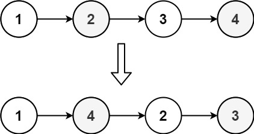

# [143. Reorder List](https://leetcode.com/problems/reorder-list/) <span style="color:orange">Medium</span>

## **The Problem**
You are given the head of a singly linked-list. The list can be represented as:
```
L0 → L1 → … → Ln - 1 → Ln
```
Reorder the list to be on the following form:
```
L0 → Ln → L1 → Ln - 1 → L2 → Ln - 2 → …
```
You may not modify the values in the list's nodes. Only nodes themselves may be changed.

## **Examples**
**Example 1**


```
Input: head = [1,2,3,4]
Output: [1,4,2,3]
```
**Example 2**


```
Input: head = [1,2,3,4,5]
Output: [1,5,2,4,3]
```


## **The Solution**
Solution is well written out and explained by DBabichev on his LeetCode [post](https://leetcode.com/problems/reorder-list/discuss/801883/Python-3-steps-to-success-explained). 
DBabichev breaks it down in three steps to solve this problem.

1. Find the middle of our list. For it to work properly with both even and odd number nodes, we can use a slow/fast iterator where when the fast reaches the end then slow will be in the middle of the list.
2. Reverse the second part of the lnked list. The idea for this is to keep three pointers, prev, cur, and next and change connections in place. This is the same solution for 206. Reverse Linked List
3. Finally, merge the two lists, given its head. Here we interchange nodes and in this way we do one step for one of the lists and rename list so next time we will take element from the next list and rename and so on.


## **The Code**

```python
def reorderList(self, head: Optional[ListNode]) -> None:
    """
    Do not return anything, modify head in-place instead.
    """
    slow, fast = head, head.next
    
    while fast and fast.next:
        slow = slow.next
        fast = fast.next.next
        
    second = slow.next
    prev = slow.next = None
    
    while second:
        temp = second.next
        second.next = prev
        prev = second
        second = temp
        
    first, second = head, prev
    
    while second:
        temp1, temp2 = first.next, second.next
        first.next = second
        second.next = temp1
        first, second = temp1, temp2
```