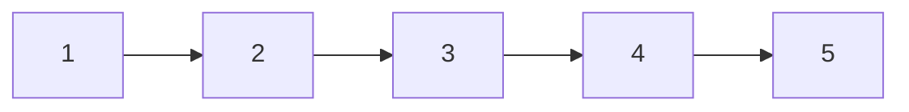
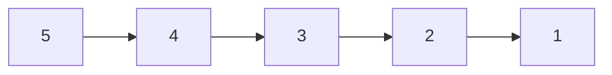
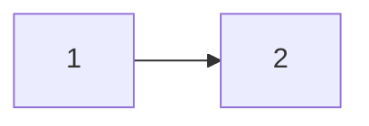
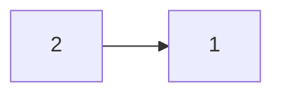

# [206. Reverse Linked List](https://leetcode.com/problems/reverse-linked-list/) <span style="color:green">Easy</span>

## **The Problem**
Given the *head* of a singly linked list, reverse the list, and return the reversed list.

## **Examples**
**Example 1**


```
Input: head = [1,2,3,4,5]
Output: [5,4,3,2,1]
```

**Example 2**


```
Input: head = [1,2]
Output: [2,1]
```

**Example 3**
```
Input: head = []
Output: []
```

## **The Solution**
To reverse the list, we're going to go through the list until the current equals next. I'll place next into a value, and then use our previous value (which was set as none) to set the next link. Then our current value will be placed into our previous variable and finally our current is switched to our next value. We continue to go on to the next linked, switch it's next pointer from the next link to the previous link, and skip through the link until our current is None which means we've reached the end of the link.

## **The Code**

```python
def reverseList(self, head: Optional[ListNode]) -> Optional[ListNode]:
    previous = None
    current = head
    next = None

    while (current is not None):
        next = current.next
        current.next = previous
        previous = current
        current = next

    head = previous
    return head
```